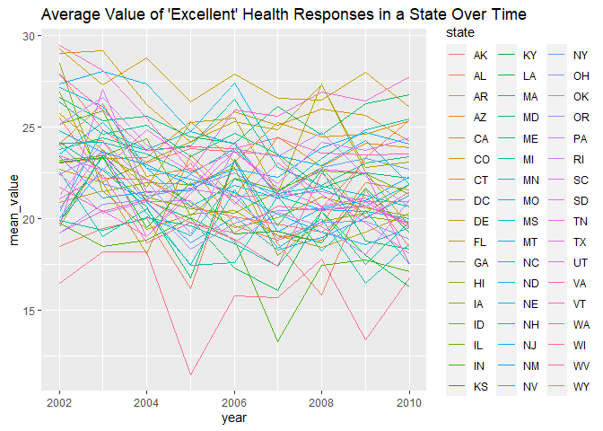
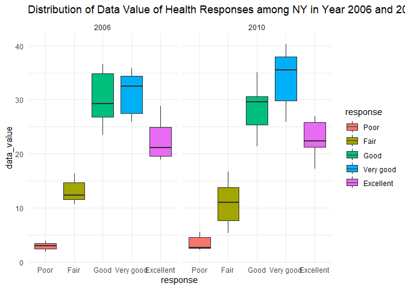
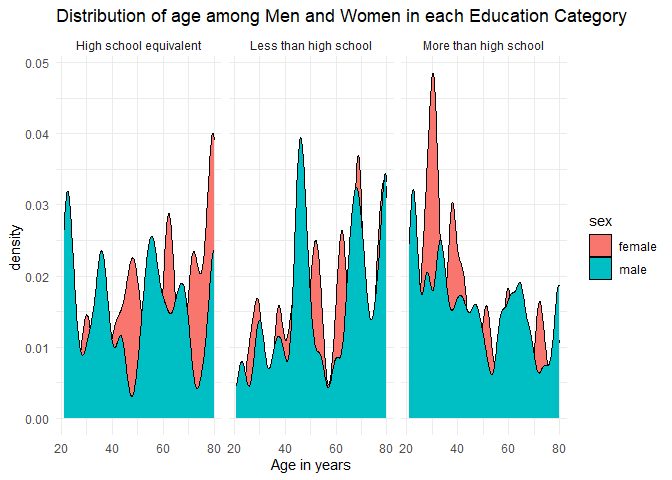
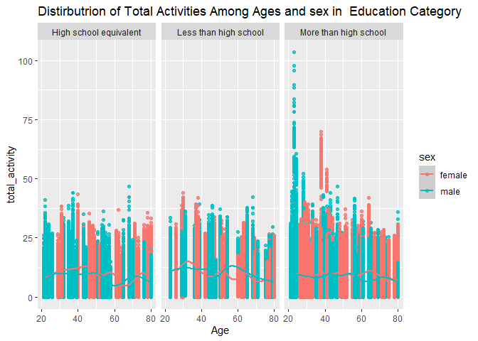
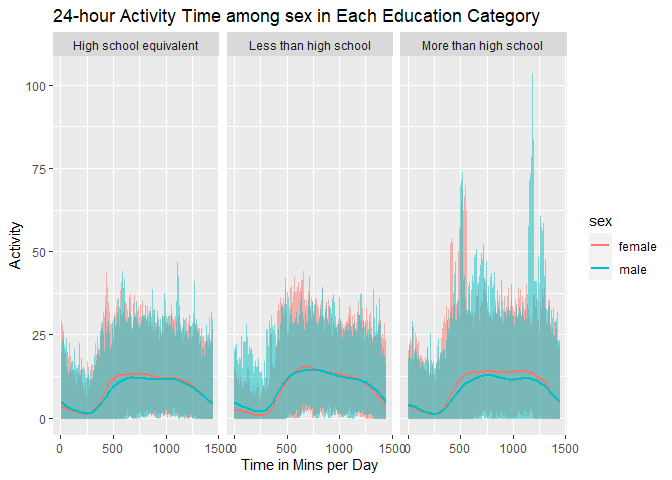

p8105_hw3_yz4719
================
Yuxin Zhang
2023-10-14

``` r
library(tidyverse)
```

    ## ── Attaching core tidyverse packages ──────────────────────── tidyverse 2.0.0 ──
    ## ✔ dplyr     1.1.3     ✔ readr     2.1.4
    ## ✔ forcats   1.0.0     ✔ stringr   1.5.0
    ## ✔ ggplot2   3.4.3     ✔ tibble    3.2.1
    ## ✔ lubridate 1.9.2     ✔ tidyr     1.3.0
    ## ✔ purrr     1.0.2     
    ## ── Conflicts ────────────────────────────────────────── tidyverse_conflicts() ──
    ## ✖ dplyr::filter() masks stats::filter()
    ## ✖ dplyr::lag()    masks stats::lag()
    ## ℹ Use the conflicted package (<http://conflicted.r-lib.org/>) to force all conflicts to become errors

``` r
library(ggridges)
library(patchwork)
library(p8105.datasets)
library(knitr)
```

### Problem 1

#### Read in the data

``` r
data("instacart")

instacart = 
  instacart |> 
  as_tibble()
```

#### Answer questions about the data

This dataset contains 1384617 rows and 15 columns, with each row
resprenting a single product from an instacart order. Variables include
identifiers for user, order, and product; the order in which each
product was added to the cart. There are several order-level variables,
describing the day and time of the order, and number of days since prior
order. Then there are several item-specific variables, describing the
product name (e.g. Yogurt, Avocado), department (e.g. dairy and eggs,
produce), and aisle (e.g. yogurt, fresh fruits), and whether the item
has been ordered by this user in the past. In total, there are 39123
products found in 131209 orders from 131209 distinct users.

Below is a table summarizing the number of items ordered from aisle. In
total, there are 134 aisles, with fresh vegetables and fresh fruits
holding the most items ordered by far.

``` r
instacart |> 
  count(aisle) |> 
  arrange(desc(n))
```

    ## # A tibble: 134 × 2
    ##    aisle                              n
    ##    <chr>                          <int>
    ##  1 fresh vegetables              150609
    ##  2 fresh fruits                  150473
    ##  3 packaged vegetables fruits     78493
    ##  4 yogurt                         55240
    ##  5 packaged cheese                41699
    ##  6 water seltzer sparkling water  36617
    ##  7 milk                           32644
    ##  8 chips pretzels                 31269
    ##  9 soy lactosefree                26240
    ## 10 bread                          23635
    ## # ℹ 124 more rows

Next is a plot that shows the number of items ordered in each aisle.
Here, aisles are ordered by ascending number of items.

``` r
instacart |> 
  count(aisle) |> 
  filter(n > 10000) |> 
  mutate(aisle = fct_reorder(aisle, n)) |> 
  ggplot(aes(x = aisle, y = n)) + 
  geom_point() + 
  labs(title = "Number of items ordered in each aisle") +
  theme(axis.text.x = element_text(angle = 60, hjust = 1))
```

<!-- -->

Our next table shows the three most popular items in aisles
`baking ingredients`, `dog food care`, and `packaged vegetables fruits`,
and includes the number of times each item is ordered in your table.

``` r
instacart |> 
  filter(aisle %in% c("baking ingredients", "dog food care", "packaged vegetables fruits")) |>
  group_by(aisle) |> 
  count(product_name) |> 
  mutate(rank = min_rank(desc(n))) |> 
  filter(rank < 4) |> 
  arrange(desc(n)) |>
  knitr::kable()
```

| aisle                      | product_name                                  |    n | rank |
|:---------------------------|:----------------------------------------------|-----:|-----:|
| packaged vegetables fruits | Organic Baby Spinach                          | 9784 |    1 |
| packaged vegetables fruits | Organic Raspberries                           | 5546 |    2 |
| packaged vegetables fruits | Organic Blueberries                           | 4966 |    3 |
| baking ingredients         | Light Brown Sugar                             |  499 |    1 |
| baking ingredients         | Pure Baking Soda                              |  387 |    2 |
| baking ingredients         | Cane Sugar                                    |  336 |    3 |
| dog food care              | Snack Sticks Chicken & Rice Recipe Dog Treats |   30 |    1 |
| dog food care              | Organix Chicken & Brown Rice Recipe           |   28 |    2 |
| dog food care              | Small Dog Biscuits                            |   26 |    3 |

Finally is a table showing the mean hour of the day at which Pink Lady
Apples and Coffee Ice Cream are ordered on each day of the week. This
table has been formatted in an untidy manner for human readers. Pink
Lady Apples are generally purchased slightly earlier in the day than
Coffee Ice Cream, with the exception of day 5.

``` r
instacart |>
  filter(product_name %in% c("Pink Lady Apples", "Coffee Ice Cream")) |>
  group_by(product_name, order_dow) |>
  summarize(mean_hour = mean(order_hour_of_day)) |>
  pivot_wider(
    names_from = order_dow, 
    values_from = mean_hour) |>
  knitr::kable(digits = 2)
```

    ## `summarise()` has grouped output by 'product_name'. You can override using the
    ## `.groups` argument.

| product_name     |     0 |     1 |     2 |     3 |     4 |     5 |     6 |
|:-----------------|------:|------:|------:|------:|------:|------:|------:|
| Coffee Ice Cream | 13.77 | 14.32 | 15.38 | 15.32 | 15.22 | 12.26 | 13.83 |
| Pink Lady Apples | 13.44 | 11.36 | 11.70 | 14.25 | 11.55 | 12.78 | 11.94 |

## Problem 2

first, load and clean the data.

``` r
data("brfss_smart2010")

clean_brfss = brfss_smart2010 |>
  # format the data to use appropriate variable names
  janitor::clean_names()|>
  
  # focus on the “Overall Health” topic
  filter(topic == "Overall Health")|>
  
  # include only responses from “Excellent” to “Poor”
 filter(response == "Excellent" | response == "Very good" | response == "Good"|response == "Fair"|response == "Poor") |>
  mutate(response=factor(response, level=c("Poor","Fair","Good","Very good","Excellent")))
clean_brfss
```

    ## # A tibble: 10,625 × 23
    ##     year locationabbr locationdesc     class topic question response sample_size
    ##    <int> <chr>        <chr>            <chr> <chr> <chr>    <fct>          <int>
    ##  1  2010 AL           AL - Jefferson … Heal… Over… How is … Excelle…          94
    ##  2  2010 AL           AL - Jefferson … Heal… Over… How is … Very go…         148
    ##  3  2010 AL           AL - Jefferson … Heal… Over… How is … Good             208
    ##  4  2010 AL           AL - Jefferson … Heal… Over… How is … Fair             107
    ##  5  2010 AL           AL - Jefferson … Heal… Over… How is … Poor              45
    ##  6  2010 AL           AL - Mobile Cou… Heal… Over… How is … Excelle…          91
    ##  7  2010 AL           AL - Mobile Cou… Heal… Over… How is … Very go…         177
    ##  8  2010 AL           AL - Mobile Cou… Heal… Over… How is … Good             224
    ##  9  2010 AL           AL - Mobile Cou… Heal… Over… How is … Fair             120
    ## 10  2010 AL           AL - Mobile Cou… Heal… Over… How is … Poor              66
    ## # ℹ 10,615 more rows
    ## # ℹ 15 more variables: data_value <dbl>, confidence_limit_low <dbl>,
    ## #   confidence_limit_high <dbl>, display_order <int>, data_value_unit <chr>,
    ## #   data_value_type <chr>, data_value_footnote_symbol <chr>,
    ## #   data_value_footnote <chr>, data_source <chr>, class_id <chr>,
    ## #   topic_id <chr>, location_id <chr>, question_id <chr>, respid <chr>,
    ## #   geo_location <chr>

**In 2002, which states were observed at 7 or more locations? What about
in 2010?**

``` r
brfss_2002=
  clean_brfss|>
  filter(year==2002) |>
  group_by(locationabbr) |>
  summarize(n_location=n_distinct(locationdesc))|>
  filter(n_location >= 7)|>
  arrange(desc(n_location))|>
  pivot_wider(
  names_from = locationabbr,
  values_from = n_location)
brfss_2002
```

    ## # A tibble: 1 × 6
    ##      PA    MA    NJ    CT    FL    NC
    ##   <int> <int> <int> <int> <int> <int>
    ## 1    10     8     8     7     7     7

In 2002 there are 6 states observed at 7 or more locations, they are PA,
MA, NJ, CT, FL, NC.

``` r
brfss_2010=
  clean_brfss|>
  filter(year==2010) |>
  group_by(locationabbr) |>
  summarize(n_location=n_distinct(locationdesc))|>
  filter(n_location >= 7)|>
  arrange(desc(n_location))|>
  pivot_wider(
  names_from = locationabbr,
  values_from = n_location)
brfss_2010
```

    ## # A tibble: 1 × 14
    ##      FL    NJ    TX    CA    MD    NC    NE    WA    MA    NY    OH    CO    PA
    ##   <int> <int> <int> <int> <int> <int> <int> <int> <int> <int> <int> <int> <int>
    ## 1    41    19    16    12    12    12    10    10     9     9     8     7     7
    ## # ℹ 1 more variable: SC <int>

In 2010 there are 14 states observed at 7 or more locations, they are
FL, NJ, TX, CA, MD, NC, NE, WA, MA, NY, OH, CO, PA, SC.

**Construct a dataset that is limited to Excellent responses, and
contains, year, state, and a variable that averages the data_value
across locations within a state. Make a “spaghetti” plot of this average
value over time within a state (that is, make a plot showing a line for
each state across years – the geom_line geometry and group aesthetic
will help).**

``` r
excellent_responses = clean_brfss|>
  filter(response == "Excellent")|>
  group_by(year, locationabbr)|>
  summarize(mean_value = mean(data_value, na.rm = TRUE))
```

    ## `summarise()` has grouped output by 'year'. You can override using the
    ## `.groups` argument.

``` r
excellent_responses_plot = excellent_responses|>
  ggplot(aes(x = year, y = mean_value, color=state))+
  geom_line(aes(color = locationabbr))+
  labs(title = "Average Value of 'Excellent' Health Responses in a State Over Time") 
excellent_responses_plot
```

<!-- -->

The“spaghetti” plot shows the average value of “excellent” health
response over time on a scale of years within a state. Different colors
represent different states, and as it shows above, most state has value
of excellent response inbetween 15-30.

**Make a two-panel plot showing, for the years 2006, and 2010,
distribution of data_value for responses (“Poor” to “Excellent”) among
locations in NY State.**

``` r
NY_distribution = clean_brfss|>
  filter(locationabbr == "NY")|>
  filter(year == 2006 | year == 2010)

NY_distribution_plot= NY_distribution|>
  ggplot(aes(x = response, y = data_value,fill=response)) + 
  geom_boxplot()+
  facet_grid(. ~ year)+
  labs(title = "Distribution of Data Value of Health Responses among NY in Year 2006 and 2010")+
  theme_minimal()
NY_distribution_plot
```

<!-- -->

This two-panel box plot shows the distribution of data value of health
response in the year of 2006 and 2010 in NY. It show as that there are
some increases in the data from 2006 to 2010.

## Problem 3

first, load and clean the data.

``` r
nhanes_covar = 
  read_csv("dataset/nhanes_covar.csv", skip = 4)|>
  janitor::clean_names()|>
  mutate(
    sex = recode(sex, "1" = "male", "2" = "female"),
    education = recode(education, "1" = "Less than high school", "2" = "High school equivalent", "3" = "More than high school"), 
    sex = factor(sex), 
    education = factor(education))|>
  drop_na()|>
  filter(age >= 21)
```

    ## Rows: 250 Columns: 5
    ## ── Column specification ────────────────────────────────────────────────────────
    ## Delimiter: ","
    ## dbl (5): SEQN, sex, age, BMI, education
    ## 
    ## ℹ Use `spec()` to retrieve the full column specification for this data.
    ## ℹ Specify the column types or set `show_col_types = FALSE` to quiet this message.

``` r
nhanes_covar
```

    ## # A tibble: 228 × 5
    ##     seqn sex      age   bmi education             
    ##    <dbl> <fct>  <dbl> <dbl> <fct>                 
    ##  1 62161 male      22  23.3 High school equivalent
    ##  2 62164 female    44  23.2 More than high school 
    ##  3 62169 male      21  20.1 High school equivalent
    ##  4 62174 male      80  33.9 More than high school 
    ##  5 62177 male      51  20.1 High school equivalent
    ##  6 62178 male      80  28.5 High school equivalent
    ##  7 62180 male      35  27.9 More than high school 
    ##  8 62184 male      26  22.1 High school equivalent
    ##  9 62189 female    30  22.4 More than high school 
    ## 10 62199 male      57  28   More than high school 
    ## # ℹ 218 more rows

``` r
nhanes_accel = 
  read_csv("dataset/nhanes_accel.csv")|>
  janitor::clean_names()|>
  pivot_longer(cols = starts_with("min"),
    names_to = "minute",
    values_to = "activity",
    names_prefix = "min"
  ) |> 
  mutate(minute=as.numeric(minute))
```

    ## Rows: 250 Columns: 1441
    ## ── Column specification ────────────────────────────────────────────────────────
    ## Delimiter: ","
    ## dbl (1441): SEQN, min1, min2, min3, min4, min5, min6, min7, min8, min9, min1...
    ## 
    ## ℹ Use `spec()` to retrieve the full column specification for this data.
    ## ℹ Specify the column types or set `show_col_types = FALSE` to quiet this message.

``` r
nhanes_accel
```

    ## # A tibble: 360,000 × 3
    ##     seqn minute activity
    ##    <dbl>  <dbl>    <dbl>
    ##  1 62161      1    1.11 
    ##  2 62161      2    3.12 
    ##  3 62161      3    1.47 
    ##  4 62161      4    0.938
    ##  5 62161      5    1.60 
    ##  6 62161      6    0.145
    ##  7 62161      7    2.10 
    ##  8 62161      8    0.509
    ##  9 62161      9    1.63 
    ## 10 62161     10    1.20 
    ## # ℹ 359,990 more rows

merge data

``` r
nhances_all =
  left_join(nhanes_covar, nhanes_accel, by = "seqn")
nhances_all
```

    ## # A tibble: 328,320 × 7
    ##     seqn sex     age   bmi education              minute activity
    ##    <dbl> <fct> <dbl> <dbl> <fct>                   <dbl>    <dbl>
    ##  1 62161 male     22  23.3 High school equivalent      1    1.11 
    ##  2 62161 male     22  23.3 High school equivalent      2    3.12 
    ##  3 62161 male     22  23.3 High school equivalent      3    1.47 
    ##  4 62161 male     22  23.3 High school equivalent      4    0.938
    ##  5 62161 male     22  23.3 High school equivalent      5    1.60 
    ##  6 62161 male     22  23.3 High school equivalent      6    0.145
    ##  7 62161 male     22  23.3 High school equivalent      7    2.10 
    ##  8 62161 male     22  23.3 High school equivalent      8    0.509
    ##  9 62161 male     22  23.3 High school equivalent      9    1.63 
    ## 10 62161 male     22  23.3 High school equivalent     10    1.20 
    ## # ℹ 328,310 more rows

**Produce a reader-friendly table for the number of men and women in
each education category, and create a visualization of the age
distributions for men and women in each education category.**

``` r
sex_education = nhances_all |> 
  group_by(sex,education) |> 
  summarize(count = n())|> 
  pivot_wider(
    names_from = sex,
    values_from = count
  ) |> 
  kable()
```

    ## `summarise()` has grouped output by 'sex'. You can override using the `.groups`
    ## argument.

``` r
sex_education
```

| education              | female |  male |
|:-----------------------|-------:|------:|
| High school equivalent |  33120 | 50400 |
| Less than high school  |  40320 | 38880 |
| More than high school  |  84960 | 80640 |

From the table we could see that there are more male fulfill high school
equivalent while the other two level of education seems more equal.

**Visualization of the Age Distributions for Men and Women in each
Education **

``` r
sex_education_age = 
  nhances_all |>
  group_by(sex,education) |> 
  summarize(mean_age = mean(age, na.rm = TRUE))
```

    ## `summarise()` has grouped output by 'sex'. You can override using the `.groups`
    ## argument.

``` r
sex_education_age
```

    ## # A tibble: 6 × 3
    ## # Groups:   sex [2]
    ##   sex    education              mean_age
    ##   <fct>  <fct>                     <dbl>
    ## 1 female High school equivalent     57.4
    ## 2 female Less than high school      57.5
    ## 3 female More than high school      45.7
    ## 4 male   High school equivalent     49.4
    ## 5 male   Less than high school      57.2
    ## 6 male   More than high school      46.6

``` r
sex_education_age_plot =
  nhances_all |>
  ggplot(aes(x = age, fill = sex))+
  geom_density()+
  facet_grid(. ~ education) +
  theme_minimal() +
  labs(title = "Distribution of age among Men and Women in each Education Category", 
       x = "Age in years",
       y = "density ")
sex_education_age_plot
```

<!-- -->

It is showed that among more than high school degree of education level,
there are more younger female, and among high school degree of education
level, there are more elder female and younger males.

**aggregate across minutes to create a total activity variable for each
participant**

``` r
aggregated_df= 
  nhances_all |> 
 mutate(total_activity = rowSums(select(nhances_all, ("activity"))))

aggregated_plot = aggregated_df|> 
  ggplot(aes(x=age, y=total_activity,color=sex))+
  geom_point(alpha=0.8)+
  geom_smooth() +
  facet_grid(.~education)+
  labs(title = "Distirbutrion of Total Activities Among Ages and sex in  Education Category",
       x= "Age",
       y= "total_activity")

aggregated_plot
```

    ## `geom_smooth()` using method = 'gam' and formula = 'y ~ s(x, bs = "cs")'

<!-- -->

As age increases, the total activities decrease. In general we can see
that females shows higher activity compare to male, excepted when in
less than high school category, men have more activities than women when
their age reaches more than 40.

#### Make a three-panel plot that shows the 24-hour activity time courses for each education level and use color to indicate sex.

``` r
group_24_activity = nhances_all|> 
  ggplot(aes(x=minute, y=activity, color=sex))+
  geom_line(alpha=0.5)+
  geom_smooth(se = FALSE)+
  facet_grid(.~education)+
  labs(title = "24-hour Activity Time among sex in Each Education Category",
       x= "Time in Mins per Day",
       y= "Activity")
group_24_activity
```

    ## `geom_smooth()` using method = 'gam' and formula = 'y ~ s(x, bs = "cs")'

<!-- -->

It shows the 24-hour activity time for both sex in three education
levels. It shows that most activities during 500-1000 mins in a day and
least activities during 0-250 mins of a day.
